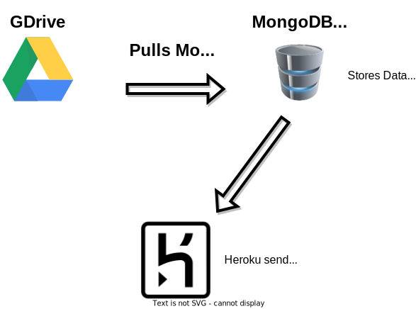

# Google Movie Database API 🎥

This project uses a combination of Google drive API,
MongoDB & MongooseJS to store and update this REST API

## <a href="https://movies-nodeapi.herokuapp.com/movies/?page=1&limit=5" target="_blank">➡️ Check out live app Here</a>

### You can change the limit and page number to fit your needs

/movies/?page=1&limit=5

## How the magic happens
